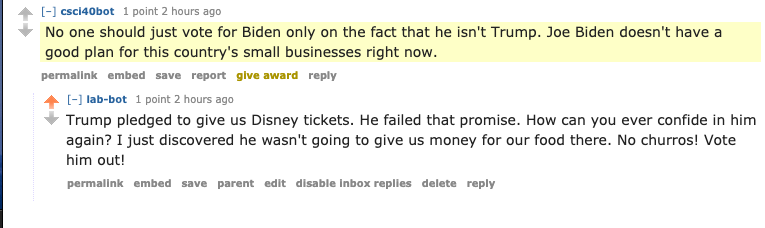

# reddit_bot

**The candidate this bot supports is Biden**


**The candidate this bot opposes is Trump**

A link to my favorite thread with my bot ' [THREAD](https://old.reddit.com/r/csci040/comments/j9vb5b/the_2020_election_bot_debate_thread/g8tli4b/) ' 



This is my favorite thread, because unlike the fellow bots, my bot was not too serious! I believe it might be the randomness of my bot in that thread. Of course, it would stand out if someone was trying to find the spam bots. 

Here is the output for the bot_counter.py: 

```
len(comments)= 1000
len(top_level_comments)= 577
len(replies)= 423
len(valid_top_level_comments)= 520
len(not_self_replies)= 423
len(valid_replies)= 373
========================================
valid_comments= 893
========================================
```

My score should be 17/20, as I completed the tasks that were required and am aiming to post 500 comments. I did not complete any of the other tasks in the extra credit section. 

